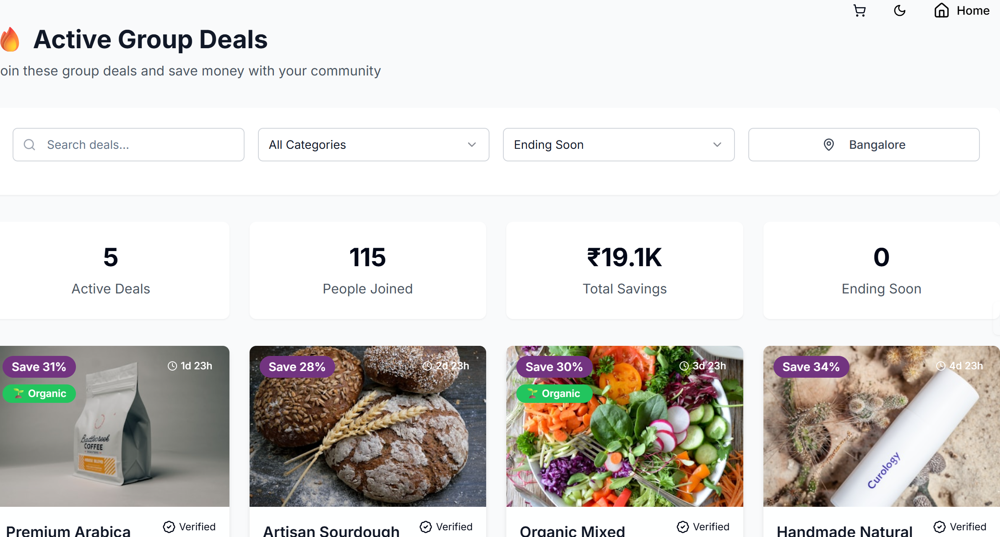
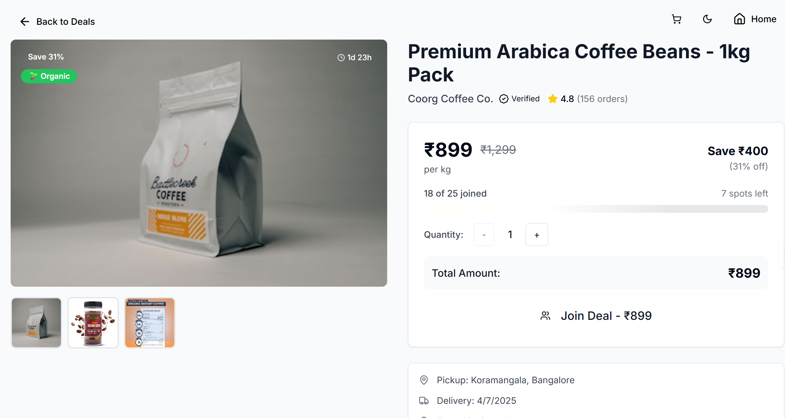
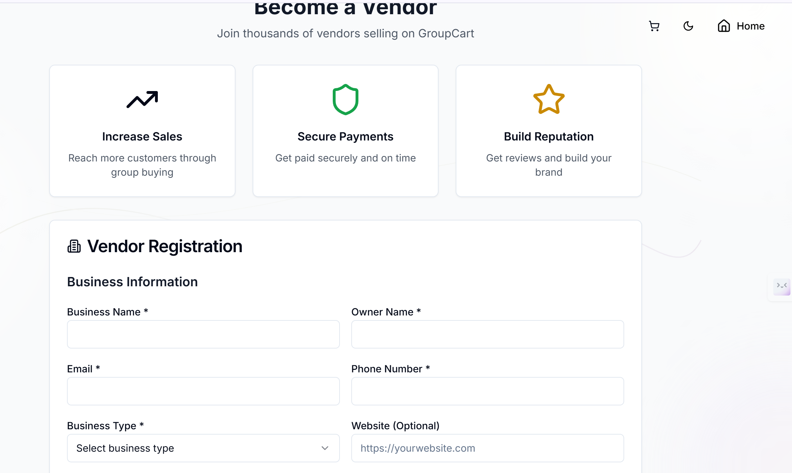

# CliQue [🔗](https://cli-que.vercel.app/)
A group buying platform where communities encouraged to save money by shopping together.  CliQue makes it easy for small businesses(vendors) to manufacture in bulk and  the client can save money by getting the product at wholesale rate . 

## Features

- 🛒 Group buying: Users can join group deals and purchase products together at discounted prices.
- 🏢 Vendor support: Vendors can list products for bulk manufacturing and reach larger groups of buyers.
- 💸 Wholesale pricing: Clients enjoy lower prices by participating in group purchases.
- 🔒 Secure authentication: Modern sign-up/sign-in functionality with role-based access for customers and vendors.
- 📊 Analytics: Vendors and admins can view sales and group activity stats.
- 🖥️ Responsive design: Works seamlessly across desktops and mobile devices.

---

## Screenshots

| Active deals page  | Group Deal Page    | Vendor Dashboard   |
|--------------------|-------------------|--------------------|
|  |  |  |

---

### Prerequisites

- [Node.js](v18+ recommended)
- [pnpm]
- [PostgreSQL] (for local development)
  
 --- 
 
## Tech Stack

- **Frontend:** Next.js, React, Tailwind CSS, Radix UI
- **Backend:** Next.js API routes, Prisma ORM, PostgreSQL
- **Auth:** JWT, role-based access

[MIT](LICENSE)

## Contact

Questions, suggestions, or feedback?  
Open an issue or reach out to [zydnet](https://github.com/zydnet).

